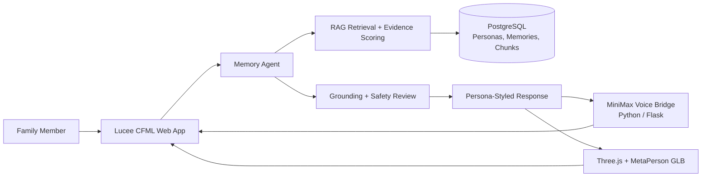

# HoloMemory AI

**A memory-grounded digital human platform for families and future generations.**

HoloMemory AI preserves family stories, voices, photos, and personal wisdom, then turns them into evidence-grounded conversations with a digital human. Instead of answering from generic model knowledge alone, the agent retrieves family memories, shows the evidence it used, applies consent and anti-fabrication checks, and responds through a cloned voice and 3D avatar.

## Live Demo

- Product demo: [http://demos.e-xanke.com/demo_hm/](http://demos.e-xanke.com/demo_hm/)
- Judge Mode: `/demo_hm/admin/judge_mode_showcase.cfm`
- Memory Retrieval Explorer: `/demo_hm/admin/memory_retrieval_explorer.cfm`
- Digital Human Pipeline: `/demo_hm/admin/digital_human_pipeline.cfm`

## Why HoloMemory

General AI answers questions. HoloMemory preserves people.

The project explores a respectful alternative to generic memorial chatbots: a family-controlled memory companion whose answers remain visibly connected to authorized source material.

## Key Features

- **Memory-grounded agent:** retrieves relevant chunks from family stories, photo notes, diaries, chats, and recordings.
- **Visible evidence:** shows which memories were selected and how they contributed to the response.
- **Digital persona:** combines identity, speaking style, family relationship, and remembered expressions.
- **Cloned voice:** uses MiniMax voice cloning with a browser TTS fallback.
- **3D avatar:** displays MetaPerson GLB avatars with Three.js in a cinematic hologram chamber.
- **Grounding and safety:** avoids invention when evidence is weak and labels AI-generated output.
- **Gesture reaction:** optional local-only camera motion detection triggers a subtle avatar reaction without uploading frames.
- **Judge-ready explainability:** dedicated showcase pages communicate retrieval, evidence selection, and the digital-human creation pipeline.

## Demo Flow

1. A family member asks Grandpa Li about an Ocean Park trip.
2. The agent classifies the intent and searches the family memory archive.
3. Relevant memory chunks are scored and selected as evidence.
4. The response is composed in Grandpa Li's warm, concise speaking style.
5. Safety and grounding checks reduce unsupported claims.
6. MiniMax generates the cloned voice while the 3D avatar reacts.
7. The UI displays the answer and the memories used.

## Architecture



See [docs/ARCHITECTURE.md](docs/ARCHITECTURE.md) for the detailed request flow, data model, and Google Cloud deployment path.

## Technology Stack

| Layer | Technology |
| --- | --- |
| Frontend | HTML, CSS, JavaScript, Three.js, GLTFLoader |
| Web application | Lucee CFML |
| Agent orchestration | CFML `AgentService` |
| Retrieval | Local lexical/semantic scoring in `RagService` |
| Data | PostgreSQL |
| Voice | MiniMax voice clone, browser TTS fallback |
| Avatar | MetaPerson Avatar SDK, GLB, Three.js |
| Voice bridge | Python 3 / Flask |

## Repository Structure

```text
Demo_HM/
|-- README.md
|-- .env.example
|-- docs/
|   |-- ARCHITECTURE.md
|   `-- DEVPOST_DESCRIPTION.md
`-- src/
    |-- index.cfm
    |-- admin/
    |-- api/
    |-- assets/
    |-- services/
    |-- sql/
    `-- voice_clone_service/
```

## Local Setup

### 1. Database

Create a PostgreSQL database named `demo_hm`, then run:

```text
src/sql/001_schema.sql
src/sql/002_seed.sql
```

Create a Lucee datasource named `demo_hm`.

### 2. Web Application

Deploy the contents of `src/` as `/demo_hm/` on Lucee/IIS or another Lucee-compatible server.

### 3. Environment Variables

Copy the values described in `.env.example` into the server environment. Never commit real provider credentials.

Required for provider integrations:

- `MINIMAX_API_KEY`
- `METAPERSON_CLIENT_ID`
- `METAPERSON_CLIENT_SECRET`

Optional:

- `MINIMAX_REGION`
- `MINIMAX_API_HOST`
- `MINIMAX_GROUP_ID`
- `HM_PUBLIC_BASE_URL`
- `HM_VOICE_BRIDGE_URL`

Restart the Lucee application after changing environment variables.

### 4. Voice Bridge

```bash
cd src/voice_clone_service
pip install -r requirements.txt
python server.py --project-root ..
```

## Privacy and Safety

HoloMemory is designed as a memory companion, not a tool for deceptive impersonation.

- Use only consented family photos, recordings, and stories.
- Clearly label AI-generated responses and audio.
- Keep provider keys server-side.
- Provide deletion, access control, and audit capabilities in production.
- Refuse high-risk legal, financial, medical, or identity-authority requests.
- Do not upload webcam gesture frames; detection runs locally in the browser.

## Current Limitations

- Retrieval currently uses local scoring rather than production embeddings.
- The demo uses a small, curated family-memory dataset.
- Avatar gesture reaction is a lightweight visual effect, not motion capture.
- Production deployment requires stronger authentication, consent workflows, encryption, and tenant isolation.

## Google Cloud Deployment Path

The current hackathon prototype runs on Lucee, PostgreSQL, and a local Python voice bridge. A production Google Cloud deployment can package the web app and voice bridge for Cloud Run, move PostgreSQL to Cloud SQL, store consented media in Cloud Storage, manage credentials with Secret Manager, and replace or augment local scoring with Vertex AI embeddings.

## Documentation

- [Detailed Architecture](docs/ARCHITECTURE.md)
- [Devpost Submission Copy](docs/DEVPOST_DESCRIPTION.md)
- [Deployment Notes](src/docs/README_DEPLOY.md)

## Team

Built by Wayne Lou for the Google Cloud Rapid Agent Hackathon.
