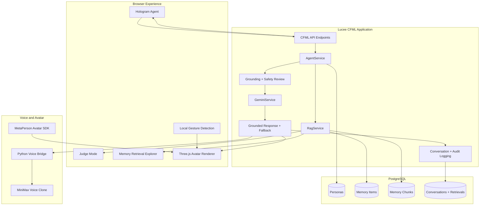
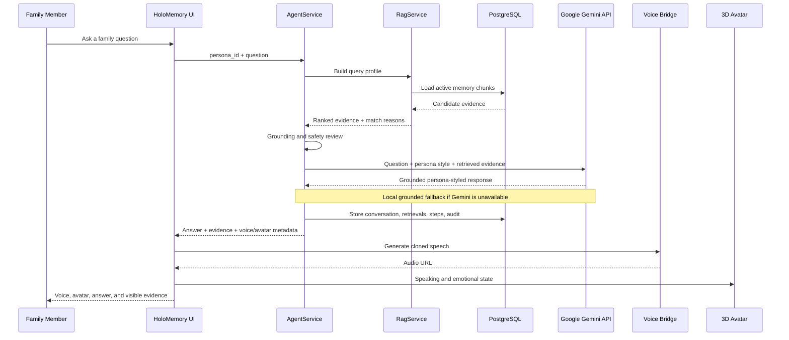
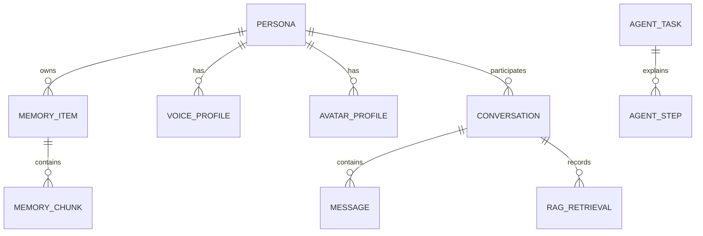
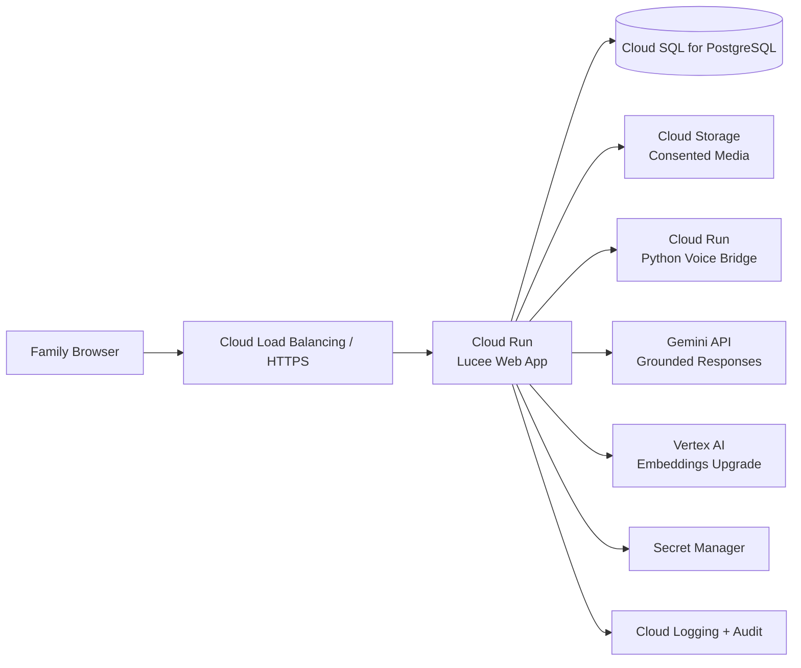

# HoloMemory AI Architecture

## System Overview

HoloMemory AI is an evidence-grounded digital-human system. It separates memory retrieval, persona composition, safety review, voice generation, and avatar presentation so that every response can remain traceable to family-approved source material.

## Grounded Response Sequence

## Core Data Relationships

## Component Responsibilities

### Browser

- Renders the cinematic product experience.
- Loads and animates GLB avatars with Three.js.
- Displays retrieved memories and evidence usage.
- Plays generated voice audio.
- Performs optional gesture detection locally without sending frames to the server.

### Lucee CFML

- Exposes the application API.
- Loads persona, voice, avatar, and consent metadata.
- Coordinates retrieval, safety, response composition, logging, and provider adapters.

### Retrieval and Grounding

- Builds an intent and focus profile from the question.
- Scores memory chunks across title, summary, transcript, keywords, location, date, and emotion.
- Returns evidence excerpts, match reasons, and grounding strength.
- Refuses to invent memories when evidence is absent or weak.

### Google Gemini

- Receives only the current question, persona speaking style, and retrieved memory evidence.
- Generates the concise natural-language response used for voice playback.
- Is instructed not to add unsupported family facts.
- Returns to a deterministic local grounded response if the API is unavailable.

### Voice and Avatar

- The Python bridge isolates MiniMax provider calls from the browser.
- MetaPerson creates exportable GLB avatars.
- Three.js renders the avatar and applies subtle visual states without skeletal retargeting.

## Google Cloud Integration and Production Topology

The current prototype calls the Google Gemini API for grounded response generation. It is portable to the following broader Google Cloud architecture:

Recommended production controls:

- Secret Manager for MiniMax and MetaPerson credentials.
- Cloud SQL private connectivity and encrypted backups.
- Signed Cloud Storage URLs for consented media.
- Identity-aware access controls for family workspaces.
- Vertex AI embeddings or vector search for larger memory archives.
- Cloud Logging for retrieval, consent, deletion, and safety audits.

## Trust Boundaries

1. Provider credentials remain server-side and are loaded from environment variables.
2. Family media must be consented and access-controlled.
3. Browser gesture frames remain on-device.
4. Every generated response carries grounding and AI-generated labels.
5. Production systems should support revocation, deletion, export, and family-level permissions.
