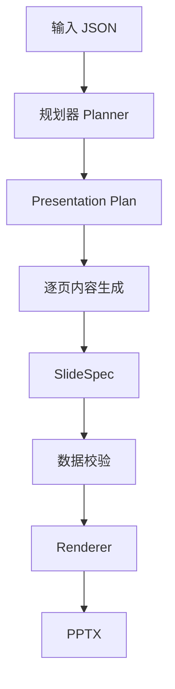
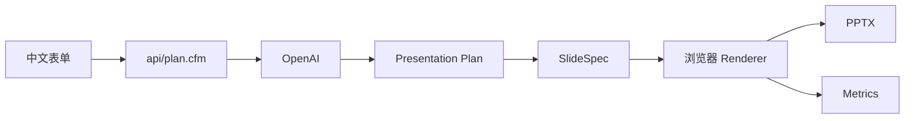

# AI PPT 生成器

轻量版 AI PPT 自动生成系统。输入 JSON（主题、简介、目标受众），自动生成一套 25~30 页、故事连贯、风格统一的 PowerPoint 演示文稿。

---

# 系统特点

- 两阶段生成（规划 → PPT）
- Story Driven（不是模板填空）
- 浏览器直接生成 PPTX
- 服务端仅依赖 Lucee / CFML
- 不依赖 Node、Python 或 Office
- 支持「最大化美观」与「Trade-off」两种模式

---

# 系统架构



系统采用两阶段架构：

**第一阶段**

负责生成整套 PPT 的故事线、章节、页面目标及整体风格。

**第二阶段**

根据规划按页生成内容，再统一渲染 PPT，避免一次生成整套导致重复、跑偏和上下文漂移。

---

# 部署

服务器仅需：

- Lucee / CFML
- OpenAI API Key

无需安装：

- Node.js
- npm
- Python
- Office
- LibreOffice


访问：

```
http://demos.e-xanke.com/demo_ppt/?reload=1
```

---

# OpenAI 配置

统一放在：

```
Application.cfc
```

例如：

```cfml
application.openaiApiKey="";
application.openaiModel="gpt-4o-mini";
application.openaiApiUri="https://api.openai.com/v1/chat/completions";
```

API Key 永远不会发送到浏览器。

---

# 数据流程



---

# 数据库设计

当前版本采用**轻量级无状态架构**。

Presentation Plan、SlideSpec、Metrics 在内存中完成生成，无需数据库即可运行。

为后续版本预留以下数据模型：

| 表名 | 作用 |
|------|------|
| ppt_jobs | PPT 任务 |
| ppt_plans | Presentation Plan |
| ppt_metrics | Token、耗时、成本统计 |
| ppt_logs | OpenAI 调用日志 |
| ppt_templates | 主题配置（预留） |

未来可直接切换 PostgreSQL 或 SQL Server，无需修改前端。

---

# 项目目录

```
Demo_PPT
│
├── src
│   ├── Application.cfc
│   ├── index.cfm
│   │
│   ├── api
│   │   ├── plan.cfm
│   │   ├── createJob.cfm
│   │   ├── worker_plan.cfm
│   │   ├── worker_generate.cfm
│   │   └── planStatus.cfm
│   │
│   ├── assets
│   │   ├── app.js
│   │   ├── app.css
│   │   └── pptx-browser.js
│   │
│   ├── renderer
│   │   └── PPT 渲染器
│   │
│   └── planner
│       └── 动态规划器
│
├── README.md
└── DESIGN.md
```

---

# 两种生成模式

**最大化美观版**

- 28 页左右
- 更丰富视觉设计
- 更高 Token 成本
- 更长生成时间

**Trade-off 版**

- 25 页左右
- 控制成本与速度
- 更适合批量生成

---

# Metrics

系统记录：

- 生成耗时
- 页数
- Prompt Tokens
- Completion Tokens
- Total Tokens
- 预估成本

---

# 示例主题

内置：

1. Python 入门
2. 年度复盘
3. 咖啡豆选择
4. Rust 重构订单系统
5. 京都两日游

也支持任意主题。

---

# 设计理念

- Planner 负责规划
- Renderer 负责渲染
- Story 优先于模板
- 统一 SlideSpec 中间层
- Renderer 不创造业务内容
- AI 用于生成内容，代码负责确定性输出

