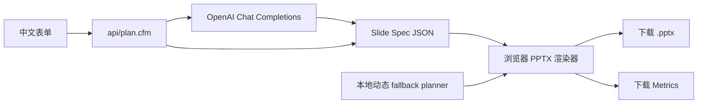

# AI PPT 生成器

轻量版 AI PPT 产品原型。用户输入主题、简介和目标受众，系统生成 25-30 页中文演示文稿大纲，并在浏览器中确定性渲染为 PPTX。

## 部署

服务器只需要 Lucee / CFML，不需要安装 Node、Python、npm 或服务端渲染进程。

把本地目录：

```text
C:\Projects\Personal\FDE\Demo_PPT\src\*
```

复制到服务器目录：

```text
C:\inetpub\demos\demo_ppt\
```

访问：

```text
http://demos.e-xanke.com/demo_ppt/?reload=1
```

## OpenAI 配置

API Key、模型和 API URI 只放在 `Application.cfc`：

```cfml
application.openaiApiKey = "";
application.openaiModel = "gpt-4o-mini";
application.openaiApiUri = "https://api.openai.com/v1/chat/completions";
```

前端不会显示或保存 API Key。浏览器只把主题、简介、受众、模式和主题风格提交给 `api/plan.cfm`。

如果 OpenAI 调用失败或没有配置 Key，前端会自动使用通用本地 fallback planner。fallback 不是 5 个硬编码 demo，而是根据任意主题粗分类为教学、复盘、说服、旅行、决策、方案、分析或自定义叙事，再动态生成 25/28 页 slide spec。

## 数据流



## 两种模式

- 最大化美观度：28 页，更强调视觉页、章节页、流程图、卡片和总结页。
- 平衡模式：25 页，控制页数和内容密度，更适合快速交付。

Metrics 会记录生成耗时、页数、模式、主题，以及 OpenAI 返回的 `prompt_tokens`、`completion_tokens`、`total_tokens` 和估算成本。

## 示例

页面内置 5 个示例只用于一键填表和 benchmark：

1. Python 入门
2. 年度复盘
3. 咖啡豆选择
4. Rust 订单系统重构
5. 京都两日游

任何新主题也应可生成，例如：

```text
主题：医疗临床证据问答系统
简介：帮助医学团队从临床试验登记库中查询研究进展、证据来源和风险
目标受众：AI 工程面试官
```

## 文件说明

```text
src/
  Application.cfc          服务端配置
  index.cfm                中文产品页
  api/plan.cfm             OpenAI 服务端代理
  assets/app.js            页面交互与本地动态 planner
  assets/pptx-browser.js   浏览器 PPTX 渲染器
  assets/app.css           企业级中文 UI
```
