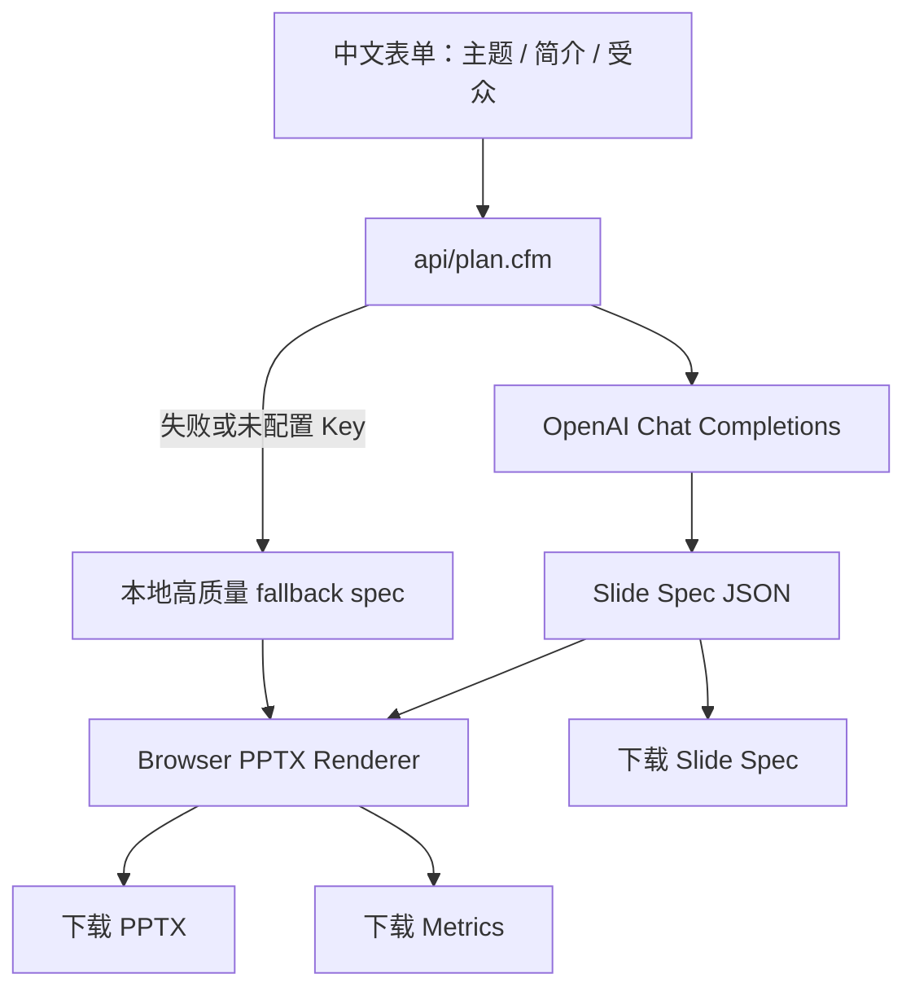

# 设计决策日志

## 1. 架构与数据流

本项目采用“服务端规划、浏览器渲染”的轻量架构。服务器不安装 Node / Python / npm；Lucee 只负责页面、配置和 OpenAI 代理调用；浏览器负责确定性生成 PPTX。

API Key 不放前端。`application.openaiApiKey` 和 `application.openaiModel` 只存在于 `Application.cfc`，前端永远不显示、不保存、不传入 Key。

## 2. 模型选型

默认模型为 `gpt-4o-mini`。原因：

- 速度快，适合现场快速生成 25-28 页大纲。
- 成本低，适合反复测试。
- 结构化 JSON 输出能力足够，能稳定返回 deckTitle、slides、layoutType、points、visualType。
- 本任务需要的是“规划 Slide Spec”，不是让模型直接生成 PPT 文件。

不混用多个 provider。多 provider 会增加 Key 管理、错误处理、成本估算和调试复杂度，而本项目更需要稳定、可解释、能按时交付。

## 3. 风格一致性

系统使用 Theme Token + Layout System + Renderer Determinism：

- Theme Token 控制背景色、主色、强调色、正文色、卡片样式。
- Layout System 控制 cover、agenda、section、timeline、process、cards、matrix、quote、summary、closing 等页面。
- Renderer Determinism 保证每页都有统一页码、footer、标题层级、留白和视觉元素。

LLM 只决定结构，不直接决定 PowerPoint OpenXML，因此主题一致性和文件可打开性由确定性渲染器保证。

## 4. 多样性策略

多样性来自四层：

1. Narrative Type：教学路线、年度复盘、消费决策、CEO 说服型论证、旅行路线叙事。
2. Layout Rotation：同一版式不连续重复超过 2 页。
3. Theme Auto Mapping：Python 映射教育清爽，咖啡映射暖色，京都映射旅行杂志，Rust/CEO 映射商务深色。
4. Visual Type：卡片、时间线、流程、矩阵、大数字、引用和总结页混合使用。

## 5. 成本与时延实测

| Topic | Mode | Slides | Planner | Duration | Estimated Cost | Output |
|---|---:|---:|---|---:|---:|---|
| Python 入门 | balanced | 25 | fallback | 待测 | 0 | 待生成 |
| Python 入门 | beauty | 28 | fallback | 待测 | 0 | 待生成 |
| 咖啡豆选择 | balanced | 25 | fallback | 待测 | 0 | 待生成 |
| Rust 订单系统 | beauty | 28 | fallback | 待测 | 0 | 待生成 |
| 京都两日游 | beauty | 28 | fallback | 待测 | 0 | 待生成 |

OpenAI 版本：

| Mode | Model | Slides | Expected Latency | Estimated Cost |
|---|---|---:|---:|---:|
| balanced | gpt-4o-mini | 25 | 待测 | 低 |
| beauty | gpt-4o-mini | 28 | 待测 | 低 |

## 6. 踩坑和取舍

- 不用服务端 Node：服务器不能安装 Node / npm，部署会失败。
- 不用 Python：避免额外运行时和字体环境问题。
- 不用 CFML 直接画 PPT：中文字体、版式和视觉元素调整成本高。
- 不让 LLM 直接输出 PPT：文件稳定性差，难以控制页码、footer、主题和布局。
- 不做工程后台式 UI：面试作业更看重产品感和可见质量。

## 7. AI 协作复盘

- AI 曾建议服务端 Node，被推翻，因为服务器不能装 Node/Python。
- AI 曾建议工程后台式 UI，被推翻，因为作业需要产品感。
- AI 曾建议只做文字 slide，被推翻，因为 PPT 是视觉沟通。
- 人类核验清单：页面无前端 API Key、PPTX 可打开、slide count 达标、内容不重复、无乱码缩写、主题一致、生成耗时可见。
